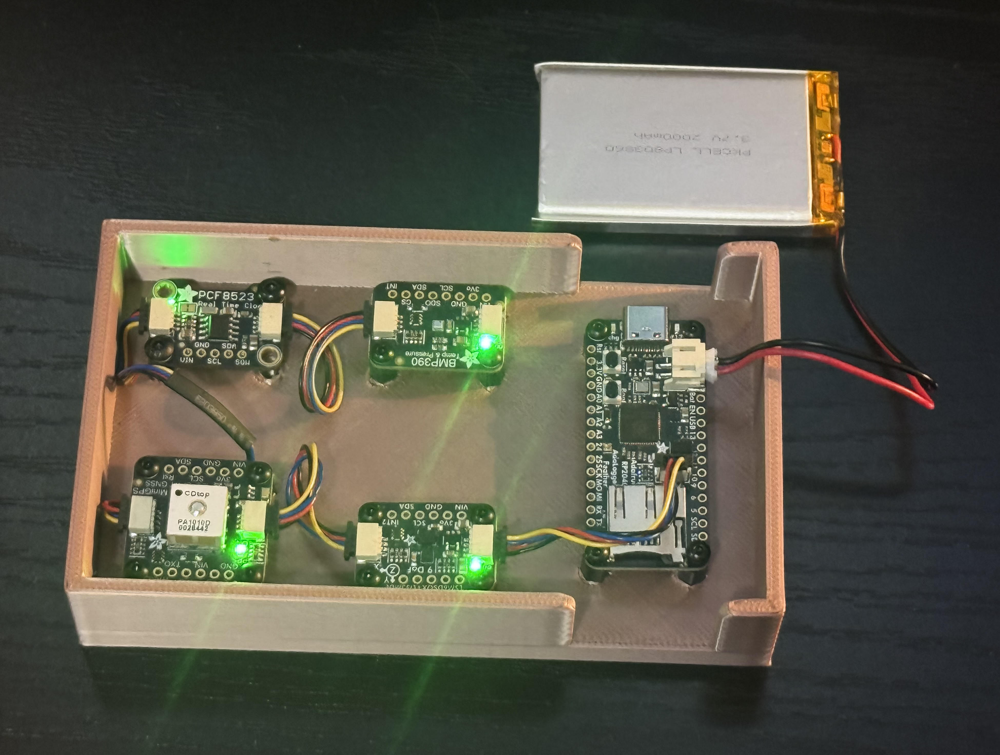
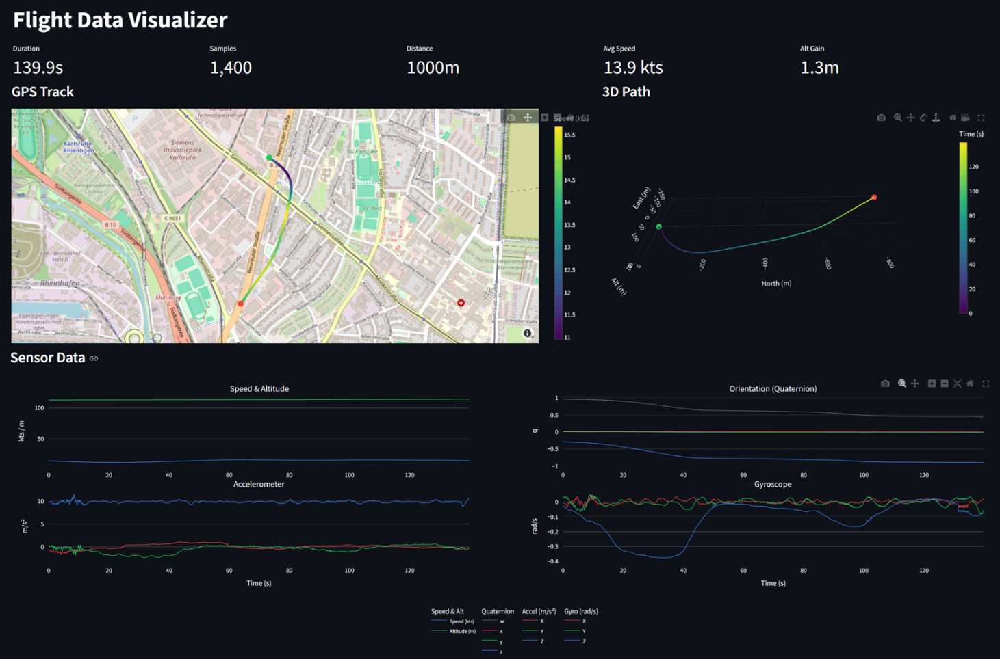
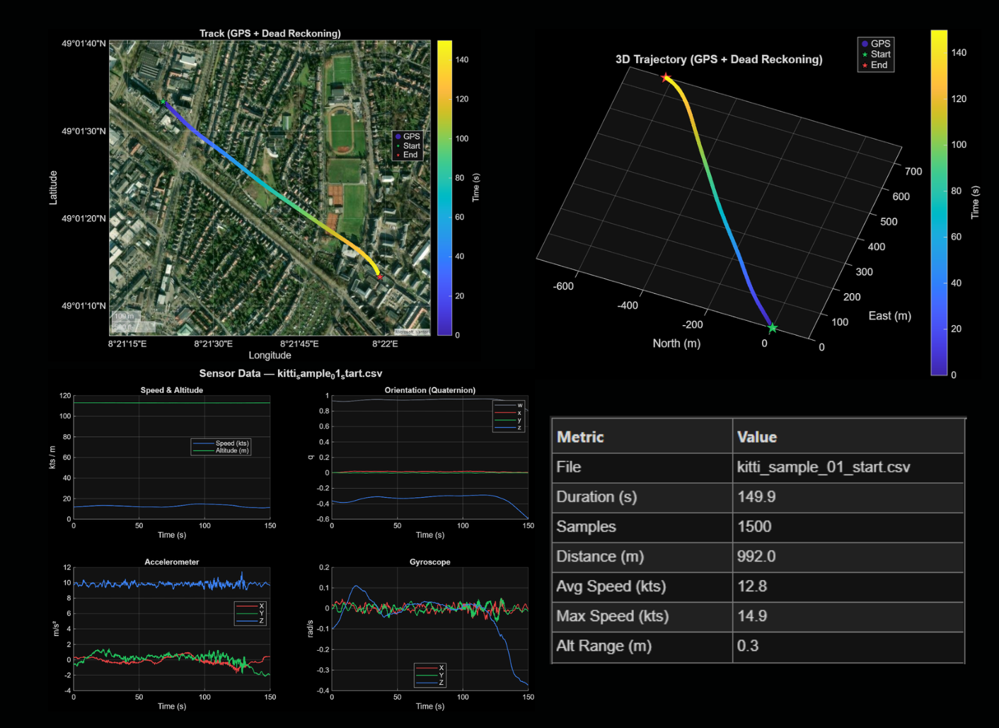
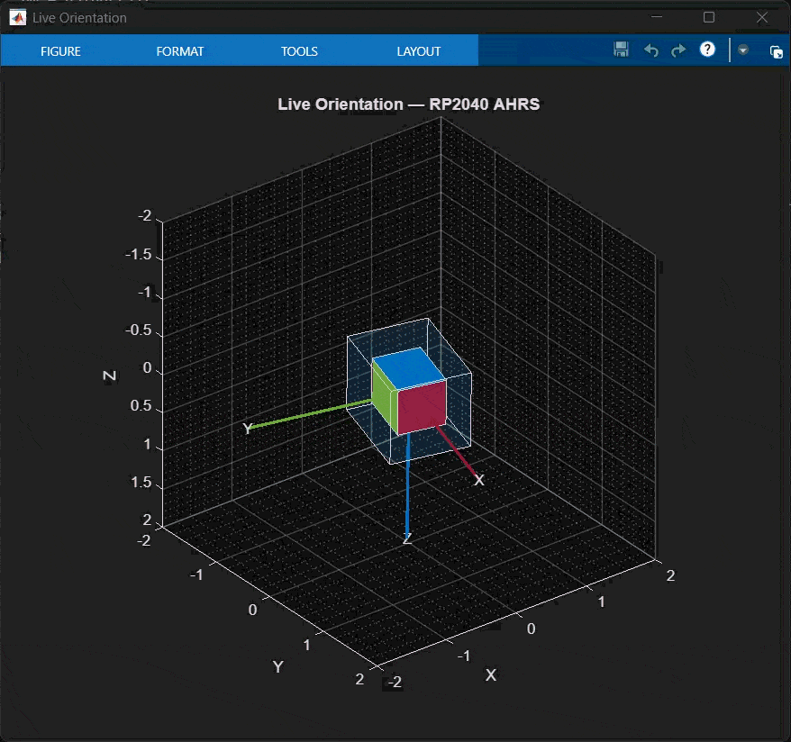

# RP2040 Black Box

Flight data logging system using an Adafruit RP2040 microcontroller to capture IMU, GPS, barometric, and magnetometer data at up to 200Hz with Mahony AHRS filtering.

## Hardware

| Component | Description |
|-----------|-------------|
| Adafruit Feather RP2040 Adalogger | Main board with SD card slot |
| Adafruit BMP390 | Barometric altimeter (50Hz) |
| Adafruit LSM6DSOX | 6-DOF accelerometer/gyroscope (208Hz) |
| Adafruit LIS3MDL | 3-axis magnetometer (155Hz) |
| Adafruit Mini GPS PA1010D | GPS module (10Hz) |
| Adafruit PCF8523 | Real-time clock |

### Hardware Guides
- [Adafruit Feather RP2040 Adalogger](https://learn.adafruit.com/adafruit-feather-rp2040-adalogger/overview)
- [Adafruit BMP390](https://learn.adafruit.com/adafruit-bmp388-bmp390-bmp3xx/overview)
- [Adafruit Mini GPS PA1010D](https://learn.adafruit.com/adafruit-mini-gps-pa1010d-module/overview)
- [Adafruit PCF8523 RTC](https://learn.adafruit.com/adafruit-pcf8523-real-time-clock/overview)
- [Adafruit LSM6DSOX + LIS3MDL 9-DOF](https://learn.adafruit.com/st-9-dof-combo/overview)

### Enclosure

The first enclosure prototype is complete.



| Part | Quantity |
|------|----------|
| M2.5 heat inserts | 14 |
| M2.5 6mm standoffs | 12 |
| M2.5 6mm screws | 12 |
| M3 heat inserts | 4 |
| M3 6mm standoffs | 4 |
| M3 6mm screws | 4 |
| 50mm STEMMA QT cable | 3 |
| 100mm STEMMA QT cable | 1 |
| 32GB SD card (FAT32) | 1 |
| 3.3V battery (2-pin JST-PH) | 1 |

---

## Project Structure

```
rp2040-black-box/
├── firmware/
│   ├── quat_datalogger/       # Dual-core Mahony AHRS + SD card logging
│   ├── calibration/
│   │   ├── magnetometer_calibration/  # MotionCal-compatible mag streaming
│   │   └── accelerometer_calibration/ # Interactive 6-position accel cal
│   └── test/
│       └── sd_card_tester/    # SD card diagnostic tool
├── software/
│   ├── flight_visualizer/     # Python Streamlit web app
│   └── matlab-visualizer/     # MATLAB trajectory plotter & live orientation viewer
├── data/
│   └── samples/               # KITTI-derived test datasets
└── hardware/
    └── boards/                # STEP files and fab prints
```

---

## Getting Started

### Arduino Setup

Add this URL to Arduino IDE > File > Preferences > Additional Boards Manager URLs:
```
https://github.com/earlephilhower/arduino-pico/releases/download/global/package_rp2040_index.json
```

Install **Raspberry Pi Pico/RP2040/RP2350** by Earle F. Philhower, III

Select board: **Tools > Boards > Raspberry Pi Pico RP2040/RP2350 > Adafruit Feather RP2040 Adalogger**

> Note: If no serial port appears, that's normal - RP2040 uses USB bootloader. A port will appear after first upload.

### Arduino Libraries

Install via Library Manager (Tools > Manage Libraries):

| Library | Purpose |
|---------|---------|
| **SdFat** | SD card operations |
| **Adafruit BMP3XX** | BMP390 altimeter |
| **Adafruit GPS Library** | PA1010D GPS |
| **RTClib** | PCF8523 real-time clock |
| **Adafruit LIS3MDL** | Magnetometer |
| **Adafruit LSM6DSOX** | Accelerometer/Gyroscope |
| **Adafruit AHRS** | Mahony sensor fusion |
| **Adafruit Unified Sensor** | Common sensor interface (dependency) |
| **Adafruit BusIO** | I2C/SPI helper (dependency) |

> **Important:** This project uses the `SdFat` library (not the standard Arduino `SD.h`) for proper RP2040 Adalogger hardware support.

### SD Card

**Hardware configuration:**
- **CS Pin:** 23 (NOT pin 10!)
- **SPI Bus:** SPI1 @ 16MHz
- **Library:** SdFat (configured automatically in firmware)

**Requirements:**
- Format: FAT32 with 4KB allocation unit size
- Works with most SD/SDHC cards

**Troubleshooting:**
If SD initialization fails, check that the card is inserted and formatted as FAT32 with 4KB allocation units. Try cleaning the contacts or using a different card. The firmware retries 5 times automatically. Use `firmware/test/sd_card_tester/` to diagnose issues.

---

## Firmware

### quat_datalogger

Dual-core flight data logger with real-time AHRS filtering and signal processing.


**Core 0** reads sensors and logs to SD at 100Hz. **Core 1** runs the Mahony AHRS filter at 200Hz.

**Signal processing pipeline:**
- Adaptive Mahony filter (Kp ramps 10.0 → 1.5, Ki = 0.01 for drift correction)
- Sensor calibration: magnetometer hard/soft iron, gyro auto-cal at boot, accelerometer offsets
- Altitude: BMP390 hardware IIR → software low-pass filter → GPS complementary filter
- Auto sea-level pressure calibration from first good GPS fix
- GPS quality rejection (min satellites, max HDOP) with low-pass filtered speed/heading
- Automatic file splitting every ~1 GB to stay under FAT32 4 GB limit

Calibration constants are loaded from `calibration.cfg` on the SD card at boot (see [Calibration](#calibration)). Filter tuning parameters are editable at the top of the firmware file.

### Calibration Sketches

Two standalone sketches in `firmware/calibration/` for computing sensor calibration values:

- **magnetometer_calibration** — Streams `Raw:` / `Uni:` data over serial in the format expected by [MotionCal](https://www.pjrc.com/store/prop_shield.html). Rotate the device in all orientations until the sphere fills in, then copy the hard/soft iron values into `calibration.cfg`.
- **accelerometer_calibration** — Interactive serial-guided 6-position calibration. Prompts you through each orientation, collects samples, and writes the computed offsets directly to `calibration.cfg` on the SD card.

### sd_card_tester

Diagnostic tool for verifying SD card compatibility. Tests initialization, read/write, and speed benchmarking.

---

## Data Format

**Output:** 20-column CSV at 100Hz

| Column | Description | Units |
|--------|-------------|-------|
| ms | Timestamp | milliseconds |
| qw, qx, qy, qz | Orientation quaternion | - |
| ax, ay, az | Acceleration | m/s² |
| gx, gy, gz | Angular velocity | rad/s |
| mx, my, mz | Magnetic field | uT |
| alt | Filtered altitude | meters |
| gps_fix | GPS lock status | 0/1 |
| lat, lon | GPS coordinates | decimal degrees |
| speed | Filtered GPS speed | knots |
| heading | Filtered GPS heading | degrees |

**File naming:**
- RTC available: `20260130_143022_0.csv`, `..._1.csv`, `..._2.csv`
- RTC unavailable: `log0_0.csv`, `log0_1.csv`, ...
- Header: `# Start: YYYY-MM-DDTHH:MM:SS`

---

## Calibration

Calibration values are stored in a `calibration.cfg` file on the SD card. The firmware reads this file at boot and applies the values automatically. If the file is missing, compiled defaults (zeros / identity) are used.

### 0. RTC (automatic)

The PCF8523 real-time clock is set automatically when the firmware detects a computer connected via USB (e.g., right after uploading the sketch). It sets the RTC to the compile timestamp, which is accurate to within a few seconds of the current time. When running on battery without a computer, the RTC keeps its existing time and is not overwritten.

### 1. Gyroscope Bias (automatic)

The firmware averages 500 samples at boot while stationary. Keep the device still for 5 seconds after power-on. The computed bias is printed to serial.

To skip the wait, note the printed values and hardcode them in the firmware:
```cpp
static const bool GYRO_AUTO_CAL = false;
static float gyro_bias[3] = { -0.0023f, 0.0041f, -0.0012f };
```

### 2. Magnetometer Hard/Soft Iron (critical for heading accuracy)

This is the most important calibration. Without it, heading (yaw) will be unreliable.

1. Upload `firmware/calibration/magnetometer_calibration/` to the board
2. Open [MotionCal](https://www.pjrc.com/store/prop_shield.html) and select the serial port
3. Slowly rotate the device through all orientations (figure-8 pattern) until the sphere fills in
4. Read the values from MotionCal and add them to a new file called `calibration.cfg` in the root of the SD card, using this format:
```
mag_hard_iron = <X>, <Y>, <Z>
mag_soft_iron = <M00>, <M01>, <M02>, <M10>, <M11>, <M12>, <M20>, <M21>, <M22>
```

Do this calibration with the device in its final enclosure. Nearby metal magnets, and mechanical stresses may affect the result.

### 3. Accelerometer Offsets

1. Upload `firmware/calibration/accelerometer_calibration/` to the board
2. Open Serial Monitor at 115200 baud
3. Follow the prompts: place the device in each of 6 orientations (X up/down, Y up/down, Z up/down) and press Enter
4. Hold the device perfectly still during each 2-second measurement
5. The computed offsets are automatically saved to `calibration.cfg` on the SD card

The sketch preserves any existing entries (e.g., magnetometer values) in the config file.

### 4. Sea-Level Pressure (automatic)

The firmware auto-calibrates from the first good GPS fix. No action needed.

For manual override, add to `calibration.cfg`:
```
sea_level_hpa = 1018.5
```

And optionally disable auto-cal in the firmware:
```cpp
static const bool BARO_GPS_AUTO_CAL = false;
```

### 5. Validation

After calibrating, run these checks on the quat_datalogger.ino firmware.

| Test | Procedure | Expected Result |
|------|-----------|-----------------|
| Static | Place flat and still for 30s after boot | Quaternion settles to ~[1, 0, 0, 0] |
| Rotation | Rotate 90° and return | Quaternion returns to original value |
| GPS walk | Walk a known rectangle outdoors | Lat/lon tracks your path, altitude is stable |

---

## Visualization

### Flight Visualizer (Streamlit)

Interactive web-based visualization.



```bash
pip install streamlit pandas numpy plotly scipy
cd software/flight_visualizer
streamlit run app.py
```

Live demo: **[rp2040-fdr-visualizer.streamlit.app](https://rp2040-fdr-visualizer.streamlit.app/)**

### Trajectory Visualizer (MATLAB)

Desktop visualization with satellite map overlays, dead reckoning, and sensor charts. Requires MATLAB with **Navigation Toolbox** (`quaternion`, `rotateframe`).



```
Open MATLAB → navigate to software/matlab-visualizer/ → run trajectoryvisualizer.m
```

A file picker dialog opens — select any 20-column CSV from `data/samples/` or from the SD card.

**Displays:**
- Summary statistics popup (duration, distance, speed, altitude range)
- 2D GPS + dead-reckoned track on satellite basemap (time-gradient colored, circle markers for GPS, diamond markers for dead reckoned)
- 3D trajectory with gradient-colored line (North/East/Altitude in meters)
- 4-panel sensor charts: Speed & Altitude, Quaternion, Accelerometer, Gyroscope

When GPS fix is lost, the visualizer dead-reckons position by rotating body-frame acceleration to NED using the quaternion, subtracting gravity, and integrating velocity/position. Barometric altitude is used for the vertical axis throughout.

### Live Orientation Visualizer (MATLAB)

Real-time 3D orientation display from live serial data. Connects to the RP2040 over USB and renders orientation using `poseplot`. Requires MATLAB with **Navigation Toolbox** and R2019b+ (`serialport`).



```
Open MATLAB → navigate to software/matlab-visualizer/ → run liveorientationvisualizer.m
```

Select a serial port and baud rate (default 115200) when prompted. The figure updates in real time as the device streams quaternion data. Close the figure window to disconnect.

---

## Future Plans

### Enclosure
- Ruggedize with TPU secondary enclosure for crash survivability

### Hardware
- Upgrade GPS module to use a larger antenna for better signal
- Design custom PCB integrating RP2040 and all sensors onto a single board
- Add Bluetooth for wireless flight data streaming
- **Consider BNO085 IMU**: Replace LSM6DSOX + LIS3MDL with BNO085 for onboard hardware EKF fusion — reduces CPU load with hardware-accelerated quaternion output and automatic calibration

### Power & Monitoring
- Optimize battery usage and create power consumption metrics
- Add internal telemetry: battery life, board temperature

### Software
- Add Simulink visualization for real-time 3D flight simulation and analysis

### AI Integration
- Transition to an AI-optimized microcontroller for on-device inference
- AI-enhanced dead reckoning to reduce position drift when GPS is unavailable
- Altitude fusion model to correct for local pressure variations
- Predict remaining battery life based on flight behavior patterns
- Auto-label flight phases (takeoff, cruise, landing, idle) from sensor signatures
- Anomaly detection to flag unusual vibration or orientation patterns
